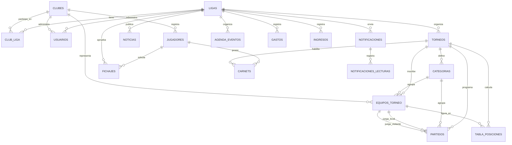

# Todo Sobre mi Liga — Modelo de Base de Datos (Fase 1)

Motor: PostgreSQL. Script de creación: `backend/migrations/0001_init_schema.sql`.

## Ideas de diseño clave

- **Multi-tenant por Liga**: casi todas las tablas cuelgan de `liga_id`, igual que en TSMC se usa `club_id`.
- **Multi-deporte a nivel Torneo**: la tabla `torneos` tiene `deporte`, `formato_juego` y `sistema_puntaje` (JSON flexible). Así una Liga de fútbol y una de vóley conviven en la misma base sin tocar el esquema.
- **Club es una entidad global**: un club puede jugar en más de una Liga (tabla puente `club_liga`), tal cual pasa en la realidad (un club de fútbol puede estar afiliado a más de una liga regional).
- **`equipos_torneo` es quien realmente juega**: no hacemos que el fixture referencie directamente al club, sino a la inscripción del club en una categoría de un torneo específico. Esto permite que Racing tenga un plantel en Primera y otro en Sub-15 dentro del mismo torneo, cada uno con su propia tabla de posiciones.
- **`partidos` es genérico**: sirve tanto para deportes de "gol" (fútbol, handball, futsal) como de "sets" (vóley), usando `resultado_local` / `resultado_visitante` de forma genérica y `detalle_resultado` (JSON) para el desglose (ej. sets de vóley).
- **`tabla_posiciones` es una caché**: se recalcula cada vez que se carga un resultado, para que el sitio web público no tenga que recalcular todo en cada visita.

## Entidades

| Tabla | Qué representa |
|---|---|
| `ligas` | Cada Liga dada de alta por el Super Admin (nombre, logo, colores, dirección). |
| `clubes` | Clubes, entidad global (pueden pertenecer a más de una liga). |
| `club_liga` | Membresía de un club en una liga. |
| `usuarios` | Login del sistema: super_admin, liga_admin, club_admin, jugador. |
| `torneos` | Torneo dentro de una liga: define deporte, formato y sistema de puntos. |
| `categorias` | Categorías de un torneo (Primera, Sub-15, Femenino, etc.). |
| `equipos_torneo` | Inscripción de un club a una categoría de un torneo (quien realmente juega el fixture). |
| `jugadores` | Jugadores/socios registrados por un club. |
| `fichajes` | Solicitud de habilitación de un jugador ante la Liga (pendiente/aprobado/rechazado). Módulo de Fichajes. |
| `carnets` | Carnet digital del jugador para el día de partido. |
| `partidos` | Fixture y resultados de cada categoría de cada torneo. |
| `tabla_posiciones` | Posiciones calculadas por categoría/torneo. |
| `noticias` | Noticias publicadas por la Liga. |
| `notificaciones` / `notificaciones_lecturas` | Avisos de la Liga a uno o todos los clubes, con seguimiento de lectura. |
| `agenda_eventos` | Agenda de la Liga (reuniones, capacitaciones, eventos). |
| `gastos` / `ingresos` | Contabilidad de la Liga (no de los clubes). |

## Diagrama entidad-relación

## Pendiente / a revisar en próximas fases

- Roles más finos dentro de `usuarios` (ej. tesorero de liga, colaborador de prensa) si hace falta más adelante.
- Tabla de sedes/canchas propia (por ahora `sede` es texto libre en `partidos`).
- Reglas de sanciones/suspensiones por tarjetas (si aplica a fútbol/handball) — se puede sumar en Fase 5 sin romper lo ya definido.
